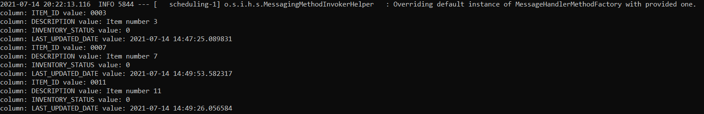

#Spring Integration DB Poller  
Create a simple Spring Integration Database Poller that can poll a database table, listening to change in a specific DB Field.

Running multiple Spring Integration Database Poller, should NOT reprocess already processed items.


### Create H2 Docker Image 
```shell
docker pull oscarfonts/h2
docker run -d -p 1521:1521 -p 81:81 -v /path/to/local/data_dir:/opt/h2-data -e H2_OPTIONS='-ifNotExists' --name=MyH2Instance oscarfonts/h2
```

Access docker H2 console on : http://192.168.1.22:81/ 

[**docker instance running on 192.168.1.22**]

### Create Schema for the demo
```shell
CREATE TABLE Items (
ITEM_ID VARCHAR(10) PRIMARY KEY,
DESCRIPTION VARCHAR(50) NOT NULL,
INVENTORY_STATUS INTEGER NOT NULL,
LAST_UPDATED_DATE TIMESTAMP);
```
### Create Sample data for demo
```shell
INSERT INTO Items (ITEM_ID, DESCRIPTION, INVENTORY_STATUS,LAST_UPDATED_DATE) VALUES ('0001', 'Item number 1', 0,CURRENT_TIMESTAMP);
INSERT INTO Items (ITEM_ID, DESCRIPTION, INVENTORY_STATUS,LAST_UPDATED_DATE) VALUES ('0002', 'Item number 2', 0,CURRENT_TIMESTAMP);
INSERT INTO Items (ITEM_ID, DESCRIPTION, INVENTORY_STATUS,LAST_UPDATED_DATE) VALUES ('0003', 'Item number 3', 0,CURRENT_TIMESTAMP);
INSERT INTO Items (ITEM_ID, DESCRIPTION, INVENTORY_STATUS,LAST_UPDATED_DATE) VALUES ('0004', 'Item number 4', 0,CURRENT_TIMESTAMP);
```

### Change SpringBoot application.properties file point to Docker H2 DB instance 

```shell

spring.datasource.url=jdbc:h2:tcp://192.168.1.22:1521/pollingdb
spring.datasource.username=sa
spring.datasource.password=
spring.datasource.driver-class-name=org.h2.Driver

```

### Build spring boot project 
```shell
mvn clean install
```

### Run mutiple instace of dbPoller 
```shell
java -jar demo-spring-integration-dbPoller-01-java-0.0.1-SNAPSHOT.jar
```
### Validation 
dbPoller1

dbPoller2

dbPoller3

dbPoller4

